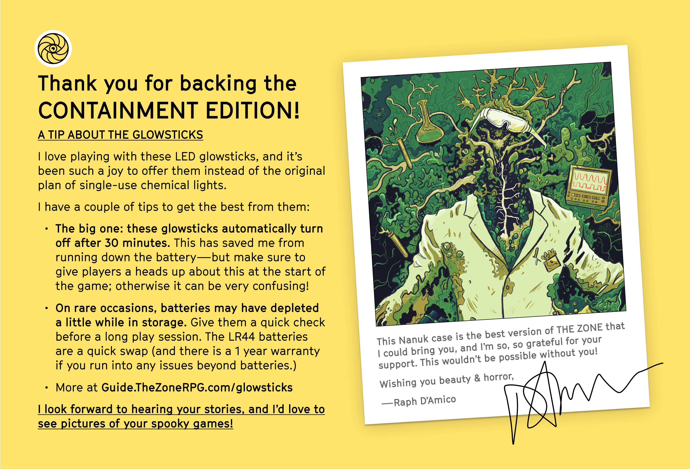

# About the glowsticks

The glowsticks supplied with the Containment Edition of The Zone are made by Dorcy. They go by the brand name [LifeGear LED Glowstick + Flashlight](https://www.dorcy.com/led-reusable-twist-glow-stick-2pack) and can be purchased either directly from Dorcy or from resellers like Amazon.

### Instructions for replacing batteries

Last time I had to replace the batteries, [these are the ones I got](https://www.amazon.com/gp/product/B07Q16ZPFC/ref=ppx_yo_dt_b_search_asin_title?ie=UTF8&th=1).

Source: [Dorcy's website](https://www.dorcy.com/downloads/dl/file/id/237/product/1140/glowstick_flashlights_batteryinstructions_2.pdf)

### 1 year warranty & replacement
If you have any problems (excluding batteries), you can contact me [raph@laughingkaiju.com](mailto:raph@laughingkaiju.com) and I'll arrange for a repair or replacement. I'll be following Dorcy's terms [here](https://www.dorcy.com/warranty). The warranty is 1 year from the date that you received your game.

*Please make sure to try replacing the batteries before contacting me—that'll always be the first thing that Dorcy asks me to check!*