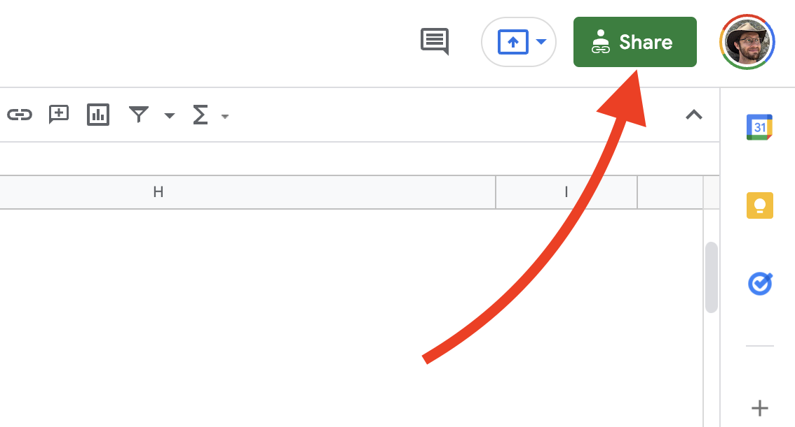
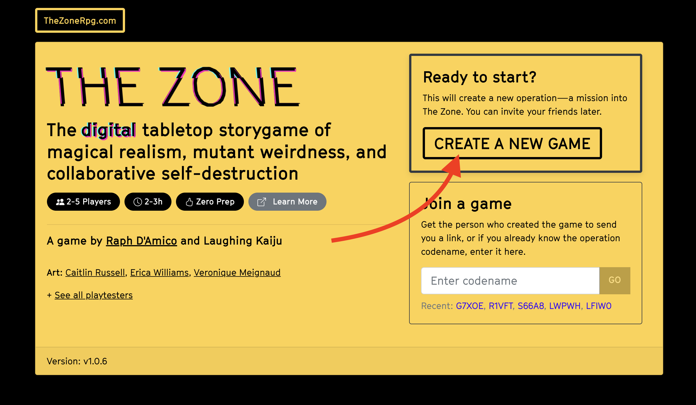
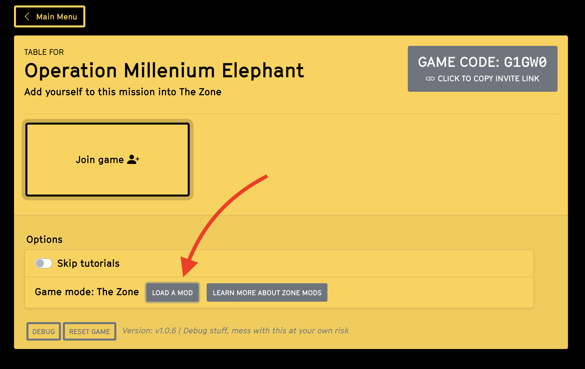
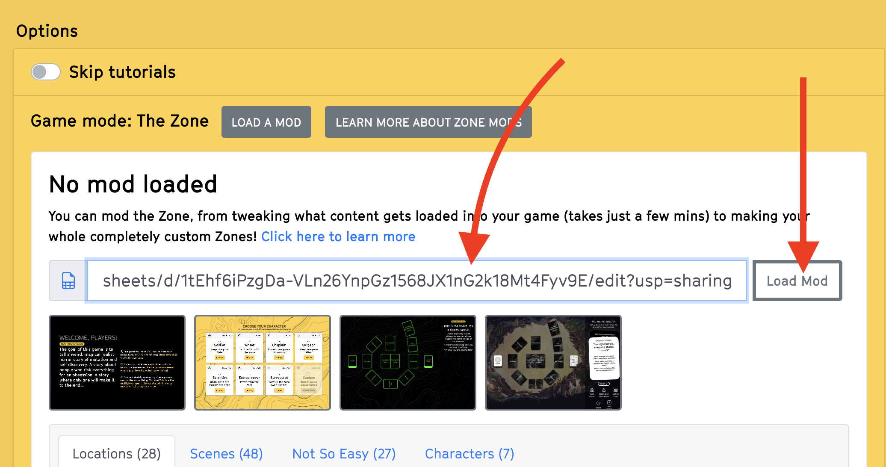

# Make Your Own Zones

## Introduction
[ WIP ]

## What can I do with this?

### Make "house" tweaks
* Want to have a game that's just Character scenes? Just remove the Scene cards you don't to have show up.
* Want a game with a particular set of locations? You can do that too!
* Minor content tweaks: what if the village was actually your hometown? What if the apartments were in your neighborhood? Or perhaps you just want to make slight changes to one of the character's backstories

### Theme the game
You may want to tweak the game colors for variety, or add your own backgrounds to better match the theme of your table.

### Make it a campaign
Maybe recurring characters return in scene cards of a next game, all set up with a briefing that changes each time.

### Total conversions
The minimum amount of content to completely make The Zone your own is:
* 6 of your own locations
* You can change whethere they are random or ordered in a particular way by changing the value of `locationOrder` 
* In the `Setup` change the `zoneName`, `campfireName`, and `centerName`
* In the `Locations`, customize `The Zone Observation Facility` and `The Boundary` (Without changing anything in the key column; they must remain as `zoneObservationFacility` and `boundary`)

## License
[ WIP ]

## Quickstart
### Step 1: Go to the [base content spreadsheet](https://docs.google.com/spreadsheets/d/1BS4btC1UNcmz3orID6nz_AM2BFF9685I0EcfTtpwb14/edit#gid=1867446837)

[Reference spreadsheet](https://docs.google.com/spreadsheets/d/1BS4btC1UNcmz3orID6nz_AM2BFF9685I0EcfTtpwb14/edit#gid=1867446837)

### Step 2: Copy the spreadsheet
Make a copy of the spreadsheet. Your whole mod will live in this spreadsheet

### Step 3: Share it
If you don't do this, the link will be private and won't work when you try to load it into the game (because it doesn't have access)

Click the "Share" button

Change the sharing persmissions to "Anyone with the link"

### Step 4: Get the link
Get the URL to your spreadsheet by clicking "Copy Link". (You could also just take it from the URL bar in your browser)

### Step 5: Load your mod

If you haven't already, create a new game

Open the "Load Mod" menu

Paste in the URL you got in the previous step

### Step 6: Enjoy!

You should see the the title change from "No Mod Loaded" to "The Zone Reference Content". That's it! Now try changing a few things in the spreadsheet and pressing "Load Mod" again to bring them into the game.

::: warning TIPS
* When you change the spreadsheet, changes will only be reflected if you manually hit "Load Mod" again
:::

## What should I change first?
Try this:
* Go to the `Setup` tab
* Change the value next to `modName` to the `The Icy Mod`
* Change the value next to `zoneName` to the `The Cold Place`
* Copy this color theme below #COLOR THEME
  |                     |                  |
  | ------------------- | ---------------- |
  | theme-primary       | hsl(212,35%,87%) |
  | theme-primaryDark   | default |
  | theme-secondary     | #8C97A1 |
  | theme-light         | hsl(212,20%,95%) |
  | theme-dark          | #2F597F |
  | theme-schematic     | #ffa700 |
  | theme-death         | #C04242 |
  | theme-zone          | aqua |
  | theme-playerCursor  | #EEF8FF |

Then try to reloading the spreadsheet
 

