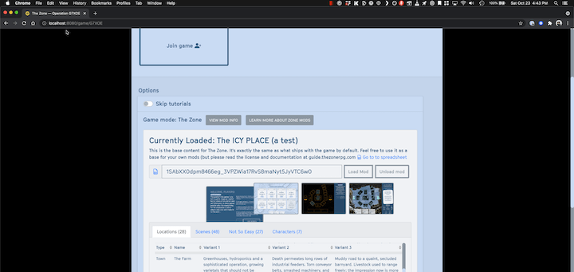

# Quickstart
### Step 1: Go to the [base content spreadsheet](https://docs.google.com/spreadsheets/d/1BS4btC1UNcmz3orID6nz_AM2BFF9685I0EcfTtpwb14/edit#gid=1867446837)

[Reference spreadsheet](https://docs.google.com/spreadsheets/d/1BS4btC1UNcmz3orID6nz_AM2BFF9685I0EcfTtpwb14/edit#gid=1867446837)

### Step 2: Copy the spreadsheet
Make a copy of the spreadsheet. Your whole mod will live in this spreadsheet

### Step 3: Share it
If you don't do this, the link will be private and won't work when you try to load it into the game (because it doesn't have access)

Click the "Share" button

Change the sharing persmissions to "Anyone with the link"

### Step 4: Get the link
Get the URL to your spreadsheet by clicking "Copy Link". (You could also just take it from the URL bar in your browser)

### Step 5: Make a few changes to the spreadsheet

Try this:
* Go to the `Setup` tab
* Change the value next to `modName` to the `The Icy Mod`
* Change the value next to `zoneName` to the `Very Cold Place`
* Copy this color theme below #COLOR THEME
  |                     |                  |
  | ------------------- | ---------------- |
  | theme-primary               | #f1ff00 | 
  | theme-light                 | #ffffff | 
  | theme-dark                	| #003333 | 
  | theme-cardTint              | #b2ff92 | 
  | theme-infoTint              | #00ff6e | 
  | theme-boardTint             | #00b0e8ff | 
  | theme-boardTintBlendMode    | soft-light | 
  | theme-cursorTint            | #00ff00 | 
  | theme-particleTint          | #ff7800 | 
  | theme-zoneTint              | #9400ff | 
  | theme-white                 | default | 
  | theme-black                 | default | 

* Try removing some locations, or changing other parts of the spreadsheet

(If you want a working test, [here is a spreadsheet to try out](https://docs.google.com/spreadsheets/d/1SAbXX0dpm8466eg_3VPZWia17RvS8maNyt5JyVTC6w0/edit#gid=753412363))

Then try to reloading the spreadsheet
 

### Step 6: Load your mod

If you haven't already, create a new game

Open the "Load Mod" menu

Paste in the URL you got in the previous step

### Step 7: Enjoy!

You should see the the title change from "No Mod Loaded" to "The Zone Reference Content". That's it! Now try changing a few things in the spreadsheet and pressing "Load Mod" again to bring them into the game.

### TIP: Navigating through the game

You will need to click back and forth through the game to see the changes that were made. The best way is to click through it by starting a new game and going through it, but this doesn't let you backtrack.

If you need to backtrack, open the Debug menu (Click the "DEBUG") button at the bottom, and use this dropdown menu to navigate through every scene in the game

If anything weird happens (which it can!), start by clicking "RESET TURN". If that doesn't fix your issue, you might have to RESET GAME and reload the mod.

::: warning TIPS
* When you change the spreadsheet, changes will only be reflected if you manually hit "Load Mod" again
* You can tweak the colors by opening the Web Inspector and scrolling down until you see the theme colors. You can change them right there.

:::