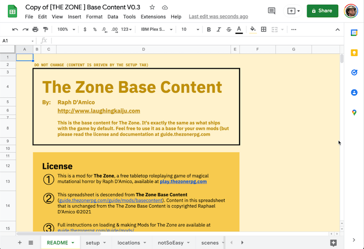

# Quickstart
### Step 1: [Click here to get a copy of the Base Content](https://docs.google.com/spreadsheets/d/1BS4btC1UNcmz3orID6nz_AM2BFF9685I0EcfTtpwb14/copy)
You'll see a screen asking if you want to "Copy document". Click [`Make a copy`](https://docs.google.com/spreadsheets/d/1BS4btC1UNcmz3orID6nz_AM2BFF9685I0EcfTtpwb14/copy)

[Link to the base content (read only)](https://docs.google.com/spreadsheets/d/1BS4btC1UNcmz3orID6nz_AM2BFF9685I0EcfTtpwb14/edit#gid=1867446837)

### Step 2: Change the permissions to "anyone with the link"

Click the "Share" button and change the sharing persmissions to "Anyone with the link." (You need to do this so The Zone has access to the spreadsheet)

### Step 3: Make some tweaks!

* Go to the `Setup` tab
* Change the value next to `modName` to `My First Mod`
* Grab one of the example themes and paste it under the `#COLOR THEME` section (in this gif I grab the `aquatic` theme)

_Wondering if you did it correctly? [Here is a spreadsheet](https://docs.google.com/spreadsheets/d/1hRlfE4RZzrii-0xbzjUTx-cZtdOGFFxE8kDd9uzJu1s/edit#gid=222892182) with these changes applied._

### Step 4: Load your mod

* Go to [play.thezonerpg.com](https://play.thezonerpg.com) to create a new game (if you haven't already)
* Click `Load a mod` to open that panel
* Get the url for your spreadsheet, paste it into the input, and click `load`
* After a few seconds you should see the mod load in 

### Step 5: You did it!

::: warning TIPS
* When you change the spreadsheet, changes will only be reflected if you manually hit "Load Mod" again
:::

### TIP: Customizing the color theme
You can tweak the colors live in the game by opening the `CONSOLE`

### TIP: Navigating through the game

You will need to click back and forth through the game to see the changes that were made. The best way is to click through it by starting a new game and going through it, but this doesn't let you backtrack.

If you need to backtrack, open the Debug menu (Click the "DEBUG") button at the bottom, and use this dropdown menu to navigate through every scene in the game

If anything weird happens (which it can!), start by clicking "RESET TURN". If that doesn't fix your issue, you might have to RESET GAME and reload the mod.

You can also navigate around the game using the debug console.

