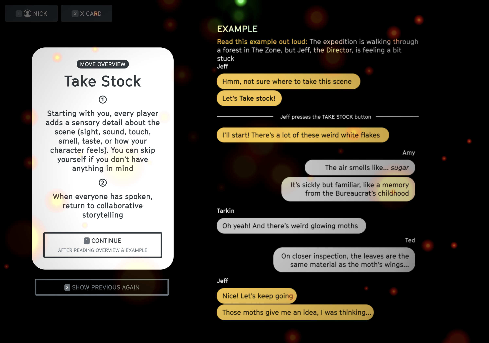
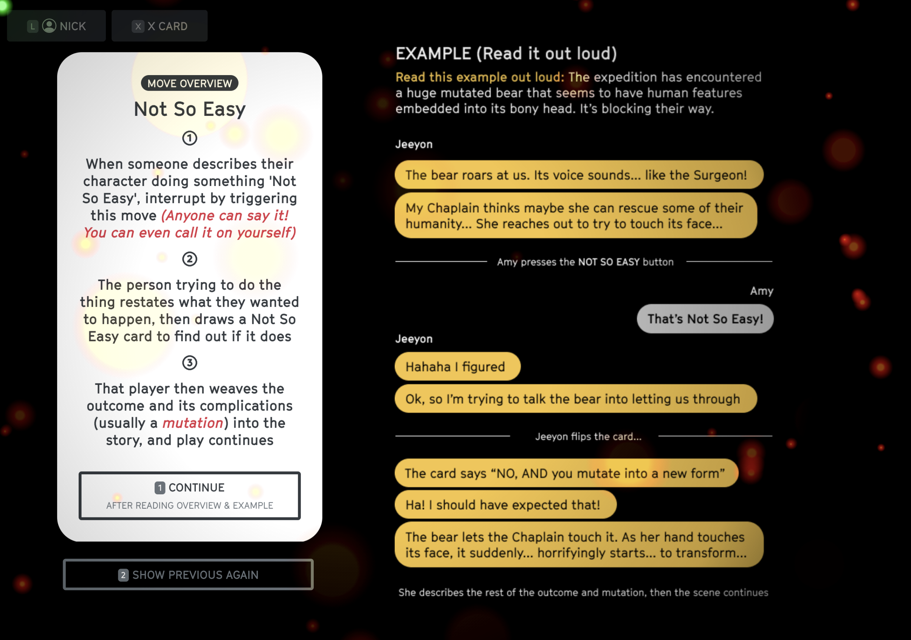

# Key Moves

## When to use the Key Moves
* Use `Take Stock` to add detail
* Use `Something's Not Right` to escalate
* Use `Not So Easy` to overcome obstacles and mutate your characters

## Take Stock

## Something's Not Right

## Not So Easy

