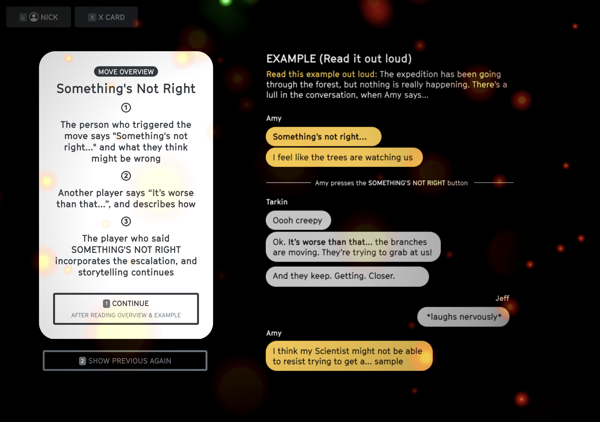

# Key Moves

## When to use the Key Moves
Anyone can use the moves at any time—it's not just for the Director.

The moves are an escalating sequence:
* Use `Take Stock` to add detail
* Use `Something's Not Right` to escalate
* Use `Not So Easy` to overcome obstacles and mutate your characters

The overall goal of these moves is to enhance storytelling by giving you all ways to add detail and escalate situations. Use them frequently!

## Take Stock
::: warning Tips for Take Stock
* Take Stock is a fantastic way to set up a new location
* Think senses: sight, sound, touch, smell, and taste of the environment around you. Make it specific.
* It's also a great way to explore character's inner feelings, particularly as a scene is winding down. This can help set up where everyone's at before the next one
:::

## Something's Not Right
::: warning Tips for Something's Not Right
* USE "SOMETHING'S NOT RIGHT" when you need to ramp up the danger in a scene
* Use it frequently! It's a great way to set up "Not So Easy" situations
:::

## Not So Easy
::: warning Tips for Not So Easy cards
* Don't trigger more than one Not So Easy for a given problem
* If you have many more Not So Easy cards than your other players, it's probably a a sign that you should be calling them on others instead of yourself
* The more Not So Easies you get while alive, the more control you'll have when you finally Play As The Zone after death.
* Yes, you can trigger Not So Easy on yourself! You should! It's a great way to get mutations. That weird anomaly, you should probably try to touch it!
:::

