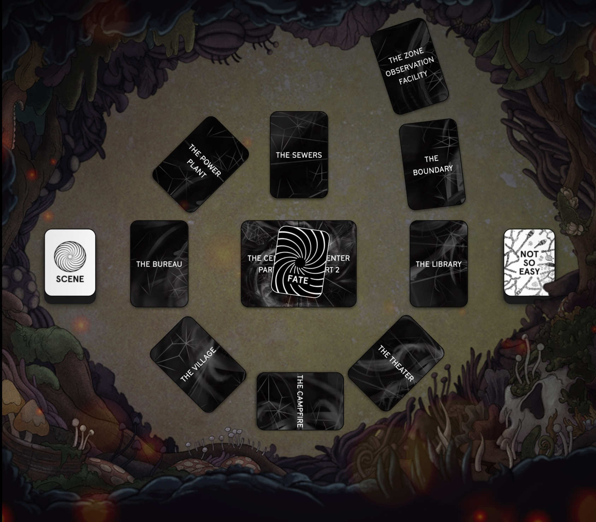
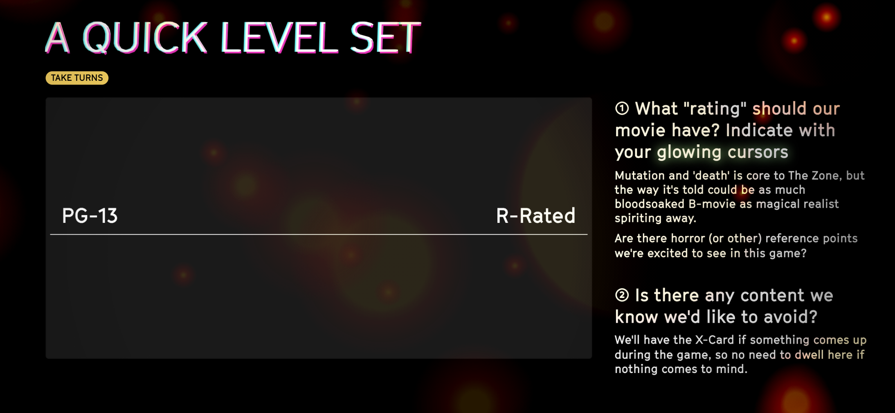

## Overview
### The goal of this game is to tell a weird, magical realist horror story of mutation and self discovery. A story about people who risk everything for an obsession. A story where only one will make it to the end...

::: warning EXPEDITION 14 BRIEFING
Welcome, volunteers. I know you've all been wondering what **The Zone** really is, and if the rumors are true. As the 14th expedition, you deserve to know what we know. It's not a lot. But it may help you.

It all started with the **anomalies**. Locals calling in to talk radio or visiting their doctors with stories of unseasonal weather; impossible objects; half-sightings of unknown creatures; claimed conversations with long dead loved ones. People disappeared. Medical notes describe bodies that started... changing.

We initiated special containment procedures. Performed tests on those who refused to evacuate. Then, as if reacting to our attention, **The Boundary** appeared and isolated everything and everyone within an area of several square miles. We don’t know if there are still survivors. Or if they're still human.

**Since that moment, not a single expedition has returned.** All lose contact minutes after leaving visual range. We're going on fragments, rumors, and occasional anomalies that seep beyond The Boundary.

We don’t know what The Zone wants—or *if* it wants. It seems to be a mirror. **It manifests whatever Phobias, Obsessions, and Memories you bring into it.** The Zone brings them to life to test you.

There are rumors that The Zone can **grant your deepest Wish** if it deems you worthy. Sensor readings show something incredibly powerful at its heart. Perhaps the only escape is the **The Center** itself.

You are the 14th Expedition. You will almost certainly not return. Good hunting. But prepare to die. The Federal Bureau of Coherence, without admitting liability, thanks you for accepting this mission.

*END MISSION BRIEFING*
:::

## This is a collaborative storytelling game

### 1. We're telling a movie
**The game is a series of scenes, which we can choose to play in as much or as little detail as we want, describing or acting out what characters are doing.**
Scenes can be as short as couple minutes, but usually ~5 minutes or so. The game will last about as long as a movie.

### 2. We will take turns being the director
**There is no GM. We take turns as director setting up and ending scenes, and all share a few key moves that anyone can trigger at any time to help the story along. No one will be forced to be on the spot for long.**
We're each in charge of our characters, but share responsibility for everything else.

### 3. We will play to lose
**We are not competing with each other. That's why our fates are secretly decided at the start, so we can focus on creating not so easy situations which characters will always take the bait on... and suffer the consequences.**
You know those moments that have you yelling "DON'T GO IN THERE!" or "DON'T TOUCH THAT!" at your favorite horror film? That's this entire game.

## What to expect
A game of The Zone takes about 2-4 hours, depending on the number of players and how quickly you move through the scenes. The sweet spot is 4 players and about 3 hours, including rules and character creation. 

### Typical flow of the game
| Time | Activity |
| --- | --- |
| 20 mins | Overview, Safety & Character Creation |
| 20 mins | Tutorial locations, learning the key moves |
| 90-120 mins | Moving through the locations   (There is a built in break in the middle, at "The Campfire") |
| 10 mins | The judgement of the final player by those who died along the way |

Overall, the first half is usually slower as characters explore the environment, themselves, and get to know the rules, and builds up unstoppable momentum in the second half after they start to die.

::: warning Controlling the length of the game
The Zone is GM-less from a storytelling perspective and takes on much of the facilitator's job of teaching the rules and running the game. The recommended way to play is to give yourself a spacious 3-4 hours and let the atmosphere sprawl. If you want the game to fit in a particular amount of time someone will have to play the role of Time Facilitator.

For a 2 hours or less game:
* Do only **one** scene per location, and keep each scene 5-7 mins long (this will be about 10 scenes) 
* Keep character creation short (encourage folks to pick a random character first and see if they like them)
* Set the tone for this time facilitation early, especially by keeping the first scene in The Zone Observation Facility tight.
* Get buy in: "Hey y'all, we mentioned that we wanted to try to keep this under 2 hours, is it OK if I keep us moving?"

If it's your first time facilitating with this group, use The Zone Observation Facility as a diagnostic. Some groups love to sink into it and will roleplay for half an hour, getting to know each other and sharing rumors. 

Rule of thumb: the whole game will last about `(Length of first scene / 3)` hours
:::

## The Board

::: warning Tip
Unless explicitly stated otherwise, we can all see roughly the same things on our screens.
If there's something only you can see, it will say
" Only you are seeing this"
:::

### The Spiral (of Locations Cards)
* This spiral of Location cards represents The Zone
* Each card is a location the expedition will go through on their one way journey to the center of The Zone.
* The game starts at The Zone Observation Facility which is right outside The Boundary.
* Once inside, **you cannot backtrack**!

### Scenes Cards
* In each location we will do a few scenes
* Expect to do two or three scenes in each location, fewer as we get closer to the center
* One turn = one scene

### Not So Easy Cards
* There are no stats or dice rolls in this game
Whenever a character tries to do something that seems like it would be "not so easy" for them, anyone can force them to pull a NOT SO EASY card
* Not So Easy cards have bittersweet outcomes that advance the story, like "YES, BUT..." and "NO, AND...", and most of them will trigger a MUTATION
* Trigger them often.

### Fate Cards
* Our fates are predetermined by Fate cards
* The character on the Fate card must die in the scene when it is revealed, unless another player sacrifices their own character
* You cannot die before your Fate card, so take risks!
* When your character dies, you keep playing as The Zone, setting up scenes as usual, with nothing to distract you from making things weird, magical, and horrible for the survivors.

### The Center
* The game ends at The Center
* The player who makes it to the center will ask The Zone to grant—or free them from—their obsession.
* The remaining players embody The Zone and decide the "survivor's" final fate...

## Game principles and Safety

### This is a horror game, so it’s most fun when we take our characters way out of their comfort zones while taking excellent care of we, the humans playing them.

### 1. The X-Card 
If something comes up in the story and we’d rather it didn’t, we'll press the X-CARD button (find and press it now!) and rewind to find another way, no questions asked. We can even X Card ourselves. Credit for the X-Card goes to [John Stavropoulos](http://tinyurl.com/x-card-rpg)

### 2. Atmospheric silence
There will times a player is pondering a question and helping them feels sooooo irresistible! We won't give in! Sometimes, folks need a little time to think... and the creepiest horrors need their time to gestate.

### 3. “Hell yeah, or no”.
We each have ironclad authority over our characters and when setting scenes up as Director. It's still fun to suggest ideas and “Yes, And...” a lot, but no pressure! If it's not an obvious “Hell yeah!”, no need to push it.

### 4. The players are more important than the game
That! ⬏ Take care of the real humans first. My friends, let's be excellent to each other

## Level setting exercise

The game will guide you through an anonymous voting exercise where everyone can express where on the intensity spectrum this story should be, from PG-13 to R-Rated.

### 1. What "rating" should our movie have?
Mutation and 'death' is core to The Zone, but the way it's told could be as much bloodsoaked B-movie as magical realist spiriting away.
Are there horror (or other) reference points we're excited to see in this game?

### 2. Is there any content we know we'd like to avoid?
We'll have the X-Card if something comes up during the game, so no need to dwell here if nothing comes to mind. If you'd like a more formal activity, I'd suggest [Lines & Veils](https://blog.roll20.net/posts/guest-blog-an-introduction-to-lines-and-veils/)

::: warning How much time to spend in this section
How long you spend in this sections depends a lot on how well you know each other already—perhaps you're a seasoned group of horror fans who have delved into the genre together for years. Or maybe you're playing with a bunch of complete strangers at a convention. 

**The situation to watch out for the most is one where *most* of you know each other, but not all of you.** This is where it's easiest for someone to feel left out, or worse be carried by the rest of a tightly bonded group into the place they'd rather not go.

🌈 Tip: calibration exercises aren't just about avoiding bad things, they're about building trust, rapport, and learning what people love so you can drive the story in those directions! If you only prime the group to think about all the things you *don't* want, it can be harder to end up where you *do* want to go.
:::