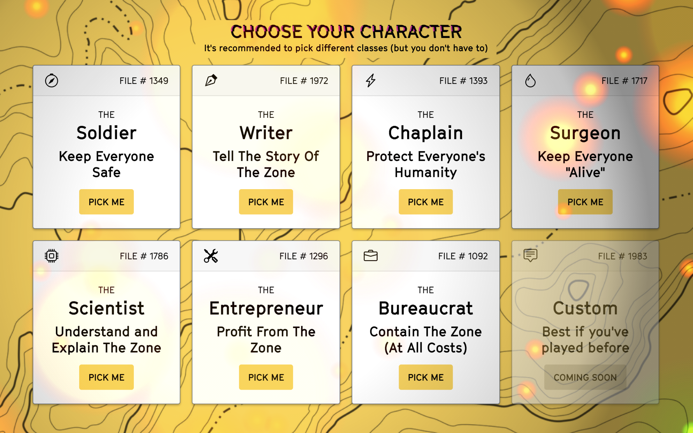
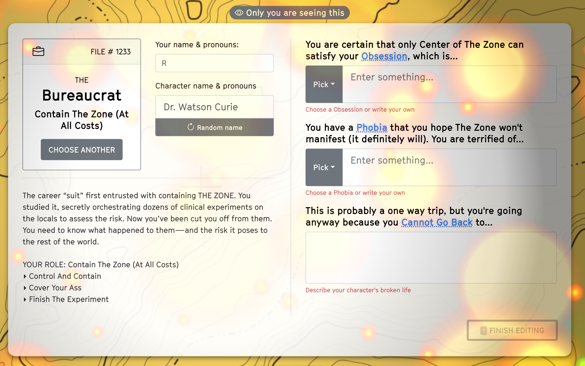

# Characters
> ### Each character will have an Obsession, a Phobia, and a reason they Cannot Go Back to their old life. All these characters share one thing: they know The Zone will almost certainly kill them, but believe it's worth it to fulfill their Obsession

There are seven default characters to pick from. It's absolutely fine for players to pick the same Archetype (it may be right for your story to have five scientists exploring The Zone), but check in with each other just in case.

### Pick an Archetype, then fill out the Obsession, Phobia, and Cannot Go Back (or write your own). 

::: warning Obsessions & Phobias are shared knowledge
The most important thing to remember is that the Obsession and Phobia are the way The Zone (as embodied by each other, the players) will push each character to its limits. These will be referenced in Scenes and Not So Easy cards. They are public, and in fact you are strongly encouraged to know each other's—especially if you are setting up a scene or a mutation that mentions someone's Obsession or Phobia being triggered.
:::

| Trait | Description | Tip |
| --- | --- | --- |
| **Archetype** | Your overall character type, and what you're doing here | |
| **Name & Pronouns** | Write your own, or get a random one | |
| **Backstory** | How you got to this point. Each character's backstory brought them to the point where they were willing to risk everything | The tragedy is the point here—something brought these folks to the point where they were willing to enter The Zone |
| **Role & Values** | Your lens on the world. Your **Role** is what you are "officially" supposed to do on this expedition, and your **Values** are how you approach this. | Use this help guide you when you're stuck for what *kind* of thing this character would do in the world. |
| **Obsession** | The singular purpose that drives your life. You've tried everything, and are now absolutely certain that only the Center of The Zone can grant it to you. | As players, use obsessions to inspire The Zone's temptations |
| **Phobia** | Your worst fear, amplified to the point where it's something that you have an uncontrollable fight, flight, or freeze reaction to when it shows up in the world. The Zone somehow knows this fear and will certainly manifest it. | As players, use each other's fears to inspire the horror of scenes |
| **Cannot Go Back** | Something back out in the world that you cannot take any more. A person or a situation that makes your life outside The Zone completely untenable, ideally related to your Obsession.| As players, use this to remind yourselves why your characters must continue. It can be a good thing to explore in flasbacks. |

::: warning Raph Thought
Unlike the Name, Obsession, and Phobia, there are no prefabricated options for "Cannot Go Back" because that short exercise of trying to come up with something is a great way to start internalizing the character. But don't overthink it! If you feel stuck, keep it short and let it emerge in play.
:::

Once everyone has created characters, you will take a few minutes to introduce each character to the group. Feel free to ask each other clarifying questions, and make sure to share your Obsession and Phobia.