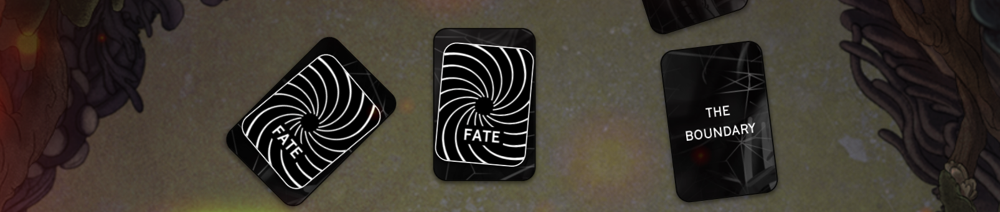
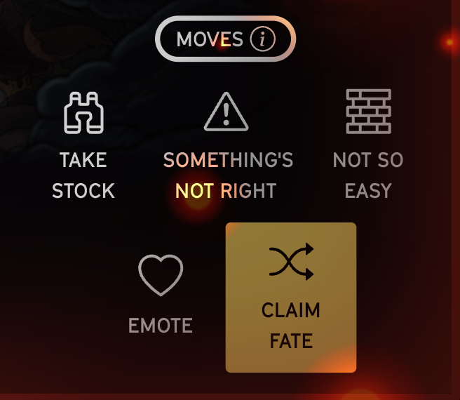
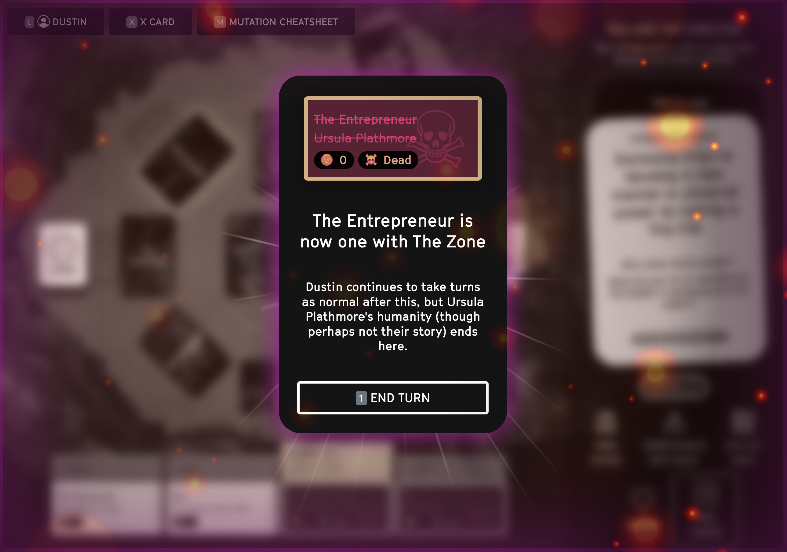

# Death

> ### Only one player will make it to the end. Everyone else will become one with The Zone (whatever that means to them)

## Fate cards

Fate cards determine when you die, and are randomly placed on top of the locations after The Campfire at the start of the game.

When you reach a location that has a Fate card on it, the first thing you will do is find out whose fate was met. This is the end of the road for this character (unless someone else takes their fate)

When you claim your fate, you immediately become The Director

::: warning You become director when you claim your fate
This section may feel a little strange compared to earlier in the game, as a director may do very little before immediately giving the role over to whoever pulled their Fate card. This is intended to match the chaotic disintegration of the expedition, but most importantly to give the player about to die the most possible agency over their death.
::: 

## Choosing to die
* You don’t have to die immediately at the start of the scene, but you cannot end the scene without dying
* Once a fate is active played, nothing can override it. You are immune to “Not So Easy” cards, and the Director cannot edit the scene until you are done. This is your moment to shine.

## Claiming Someone Else's Fate
Another player can claim your fate (if you agree to it), allowing you to live on another day. Other players can claim your fate multiple times, but of course you always have control—if you would prefer for your character to die, you cannot be stopped.

::: warning When can you claim a fate?

You can claim a fate immediately when it comes up, or anytime during the turn by clicking the "Claim Fate" button
::: 

## What happens after death

Once your character dies, you transition to embodying The Zone. You still take normal turns as Director, use all the moves, and so on.

Now is the chance to focus fully on creating the weird, magical, and horrible situations for the remaining players.

::: warning Tips for playing The Zone
* Check on everyone else's Obsessions and Phobias, so you can incorporate them into scenes
* Embody the strange creatures and anomalies that exist in The Zone
* In some cases, remnants of your character may... persist. Perhaps they have unfinished business with the living.
::: 

