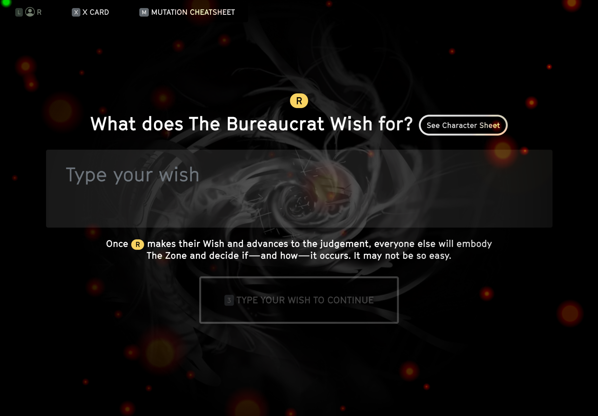
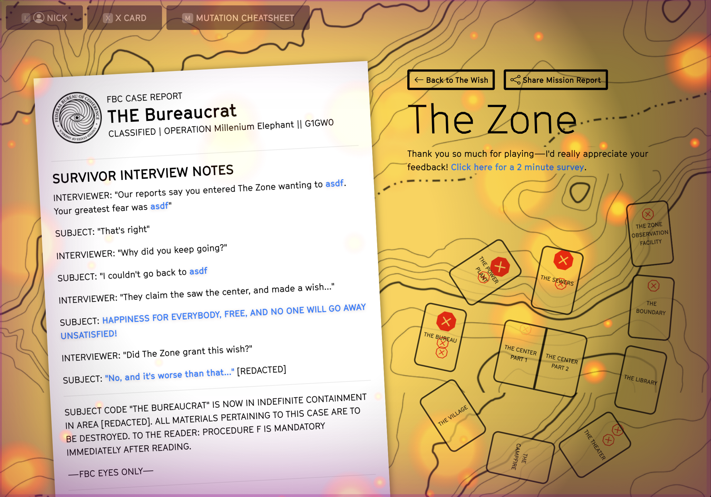

# Endgame
By the time you reach the Endgame, all but one player will have met their Fate card and died. The lone survivor is at The Center, and finally gets to ask The Zone to grant their deepest wish.

## The final player make their Wish

The final player will make their Wish. But of course, it's Not So Easy...

## Dead players play The Zone
These players will now play the other side of the Not So Easy system. 

* The person with the most Not So Easy cards will decide if and how this Wish comes to pass, by choosing one of the Not So Easy cards in their hand
* Other players (starting with whoever had the fewest Not So Easy cards), may influence this wish by offering of their own Not So Easy cards and suggesting a way it could go
* Players who got zero Not So Easy cards have been fully absorbed into The Zone and will not be able to influence this wish

## The final judgement

* The player with the most Not So Easy cards chooses from all their cards (including the ones they just received) to deliver the final judgement, and tell the story of how the "survivor" is found outside The Zone. 
* You may choose to incorporate influences from the other players who embody The Zone.
* The "survivor" gives an epilogue about their character's life after The Zone, using the Final Judgement as a starting point.

::: warning This is the end of the game
Others may ask questions, but otherwise these will be the last words spoken in the game. End the story. Make us squirm.
:::

## Mission Report

The final screen: a shareable mission report to memorialize your trip into The Zone. Oh, and a great place to give me some feedback!
