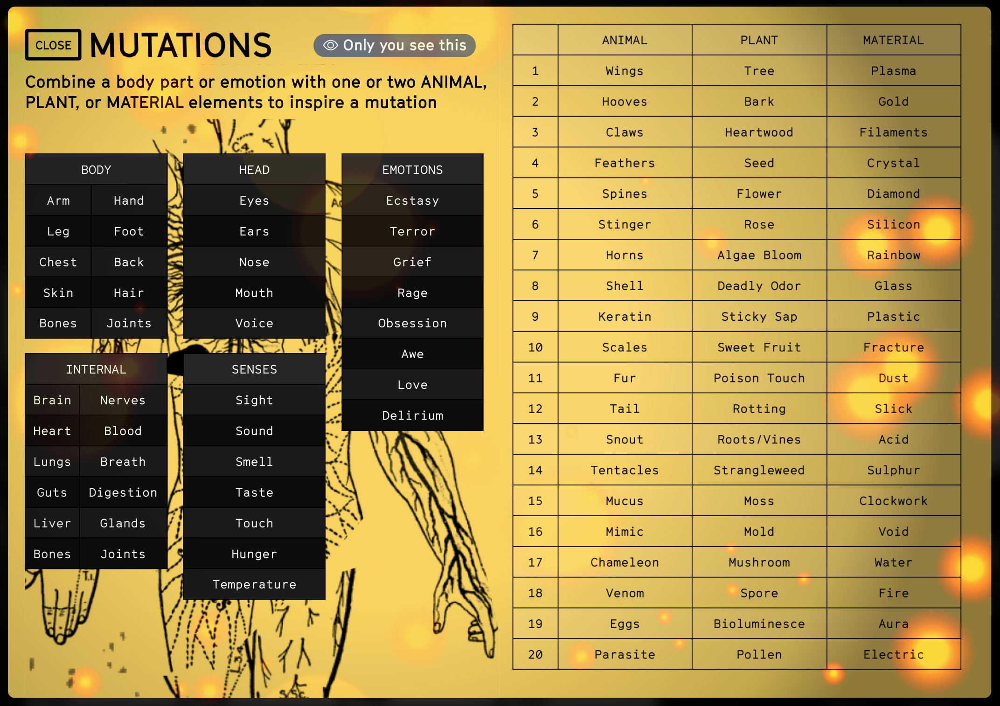

# Mutation

The creative heart of the game is this: characters horribly mutating as they try to do things that are Not So Easy. It's worth saying again: 

> ### The creative heart of the game is this: characters horribly mutating as they try to do things that are Not So Easy. 

Mutation only happens when you pull “Not So Easy” cards. As players, you want Not So Easy cards because they are essential for The Zone’s final judgement. 

This represents how the Zone only lets you progress when your characters push their limits. Terrible for your characters. Great for you as players.

When you draw a card that says Mutation, describe the gruesome changes that happen to your character. Draw on your favorite movies, or use the Mutation Cheatsheet for ideas. 

::: warning Tips for Mutation
* If you can, relate them to your character’s Obsessions or Phobias, or to things in their Broken Life
* Don't be afraid to go HARD on these mutations. You are playing to lose and you cannot die until your fate is reached.
* Be sadistic to your characters. 