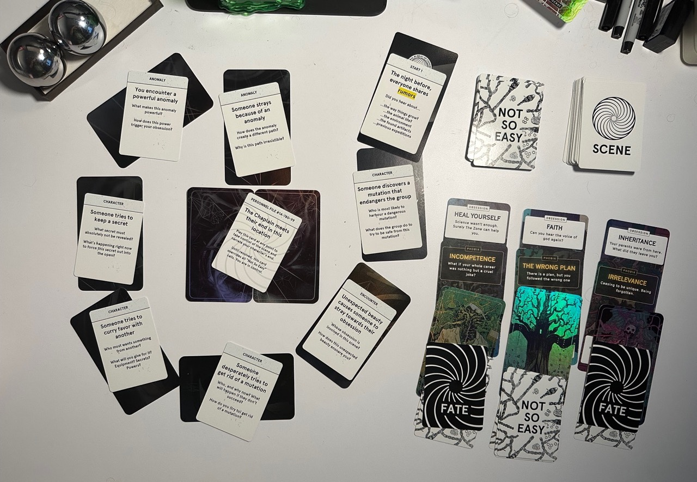
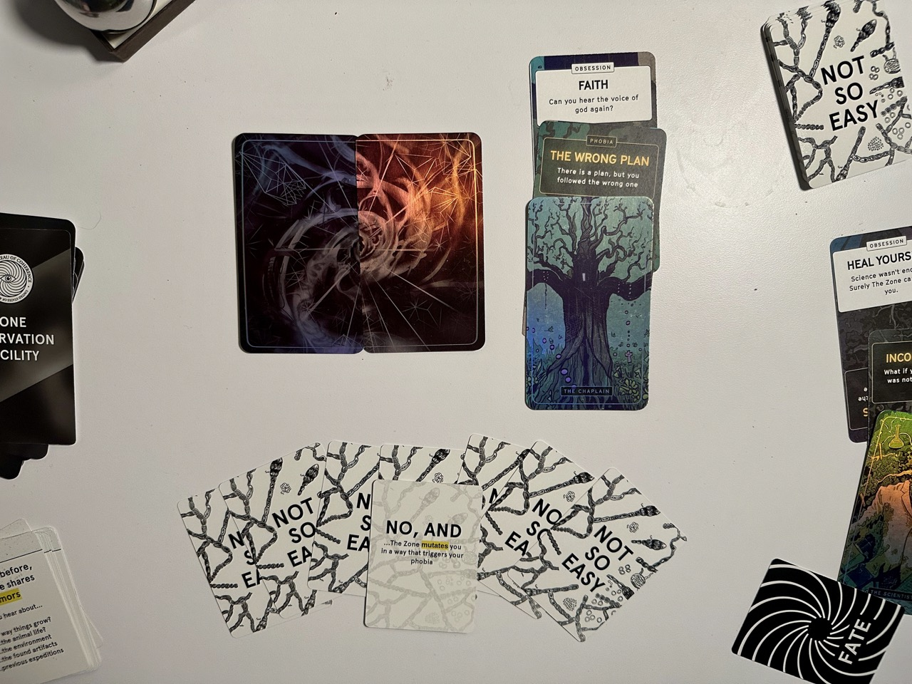

# Playing solo
The Zone is designed to work as a vehicle for creating wild stories—even if it's just by yourself! 

::: warning Known limitations of the Digital version in Solo Play
The Digital version of The Zone has a few limitations in solo play that will not be present in print, because it was originally programmed with multiplayer in mind and it will be a rather large (but exciting) challenge to write alternate copy for so many parts of the user interface. I plan to 

* You can only control one character per player. This means you can't create an expedition with multiple members unless you create multiple players, and open in each in a different tab. 
* Some SCENE cards will not apply (for example CHARACTER cards that assume another expedition member is present). When you get one, click "GET A DIFFERENT PROMPT" to get one that makes sense
* You will see text written as if there are multiple players, and some screens will be redundant (e.g. the QUICK LEVEL SET and character introductions.) 
:::

## What's different about solo play?
The overall structure of The Zone stays *identical* in Solo Play. You are still a doomed expedition, and if you bring multiple characters in only one of them will survive, with their deaths pre-determined by Fate Cards. The only difference is how to use the KEY MOVES and what happens in the Endgame. 

::: warning TIP
As with all rules these are a scaffolding to help you with your storytelling. If you don't need a piece of structure, don't use it!
:::

## Doing scenes

Just like in multiplayer, solo play casts you as the Director of this surreal horror movie. You may choose to use the SCENES that you pull as prompts for your own freeform storytelling or journaling, much like index cards in a script breakdown or chapters in a book. 

When playing solo, it's a good idea to follow the key moves in sequence as you won't have the interplay with other players to trigger them. Suggested running order:

### 1. SCENE
Pull the SCENE card. Set it up, along with the location if needed. How did the Expedition get here? Who is in the Scene? 

### 2. TAKE STOCK 
To set up the environment and how every character is feeling at the start of the scene

### 3. SOMETHING'S NOT RIGHT
Sets up the core conflict of the scene

### 4. NOT SO EASY. 
Develop the core conflict until you are able to justify something hard enough for your characters to overcome to pull a NOT SO EASY card. Resolve the NOT SO EASY card and its consequences

### 5. ESCALATE & CUT
Continue escalating as needed, or until the SCENE prompt has been addressed

## Notes on the Key Moves

### TAKE STOCK

Explicitly TAKE STOCK at the start and end of every SCENE, trying to add 3-5 details. 

If there is only one character, add a detail for each of their five senses (sight, sound, smell, touch, taste) and describe what they are feeling about the things they perceive. If there are more characters, add one detail for each of the characters you are playing. Use this to reveal their subjective perspectives at the start of each SCENE.

### SOMETHING'S NOT RIGHT
This move works exactly the same in solo play as in multiplayer, except that you will play both sides of it. Say "Something's Not Right", describe what it is, and then complete the sentence that starts with "It's Worse Than That..."

It may seem redundant, but that sentence structure is guaranteed to escalate the Scene. Treat it like a ritual phrase.

### NOT SO EASY
This works just like in multiplayer—even with other players you could always call one of these on yourself. Whenever something a character tries to do something that is too hard for them, take a Not So Easy card and use it to find out what happens.

Make it the goal of each scene to get to the point where your character has done something hard enough to use Not So Easy. Any scene that doesn't require a Not So Easy card to be pulled is a scene that isn't pushing the character hard enough.

## The solo endgame
When it's only you playing, you still make a wish and use the Not So Easy cards to determine the outcome. But instead of it being the cards belonging to the dead player who got the most, it's instead down to all the Not So Easy cards that you yourself gathered.

You should have at least 7 Not So Easy cards, or more if you escalated multiple times. When you reach the Center, you will lay them out, state your Wish, and then let The Zone decide by choosing one of them at random.

## Author's note
::: warning I love The Zone as a solo journalling game. For something that is inspired by Annihilation, I hope many pages are filled in this way...
“When I saw those hundreds of journals I felt for a long moment that I had become that old biologist after all. That's how the madness of the world tries to colonize you from the outside in, forcing you to live in it's reality.”
— Annihilation
:::

## Example in the physical version

This is an example of the setup for a Stalker style solo mission, with a Scientist, Chaplain, and Writer. Note how each of them has a Phobia and Obsession defining them. 

When playing solo I quite like to leave the scene cards that I played laid over the locations, so I can see the journey at a glance. You can see that the Scientist and Writer met their fates, and the Chaplain has made it to the Center.

Their Obsession was to hear the voice of god again, but it wasn't quite so easy... The Zone, represented by the Chaplain's Not So Easy cards, said NO, AND... (well, that last part, you'll have to fill it yourself ;)

