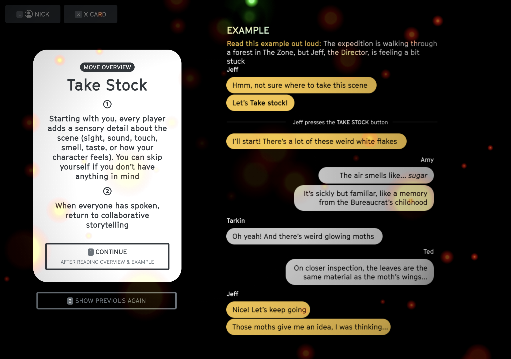

# Key Moves

## When to use the Key Moves
* Use `Take Stock` to add detail
* Use `Something's Not Right` to escalate
* Use `Not So Easy` to overcome obstacles and mutate your characters

## Take Stock

## Something's Not Right

## Not So Easy

::: warning Tips for Not So Easy cards
* Don't trigger more than one Not So Easy for a given problem
* If you have many more Not So Easy cards than your other players, it's probably a a sign that you should be calling them on others instead of yourself
:::

